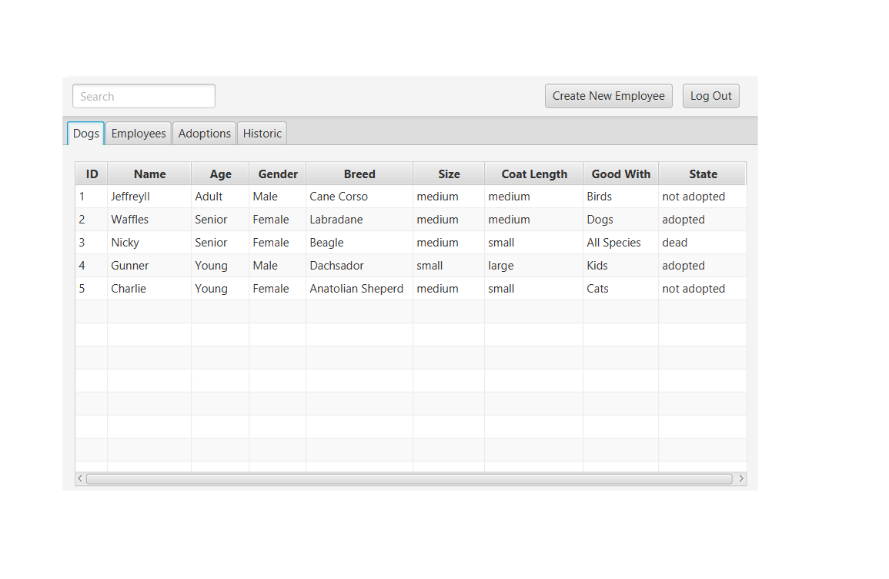
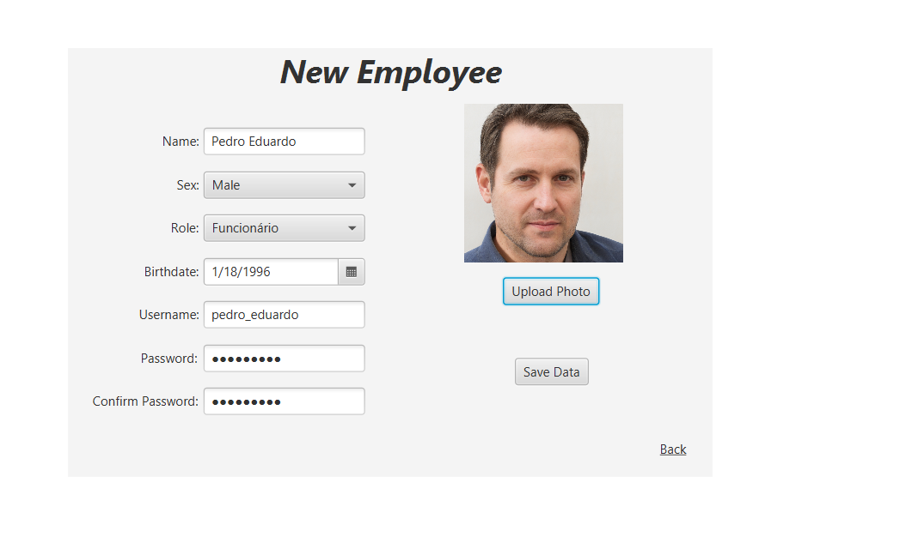
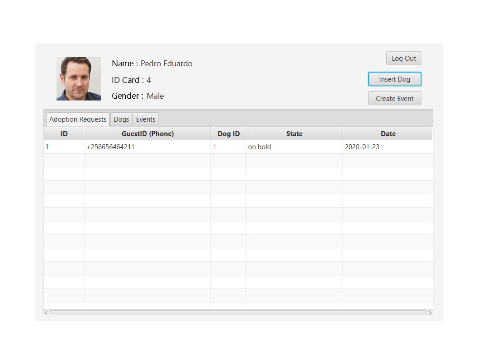
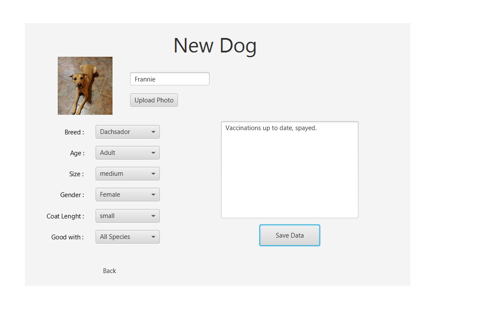
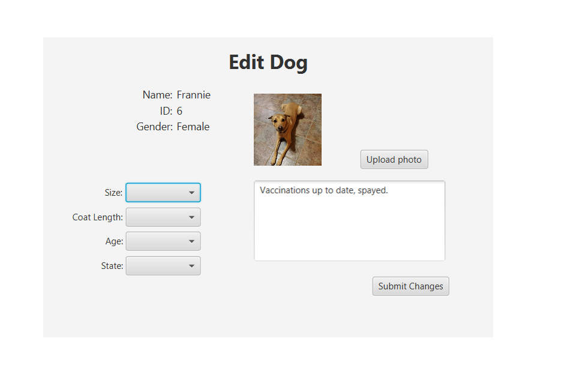
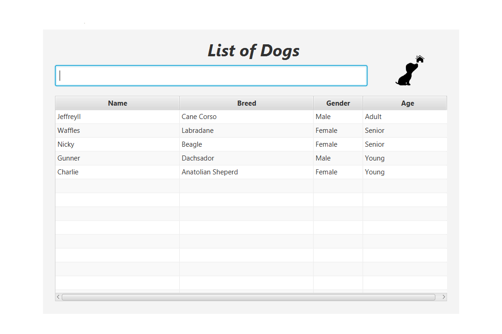
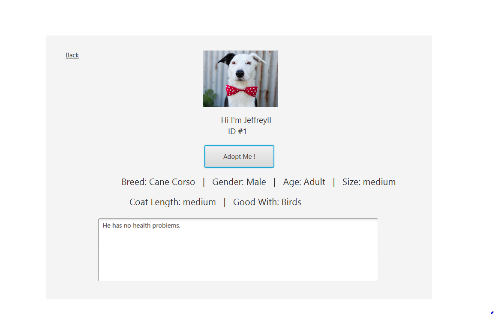
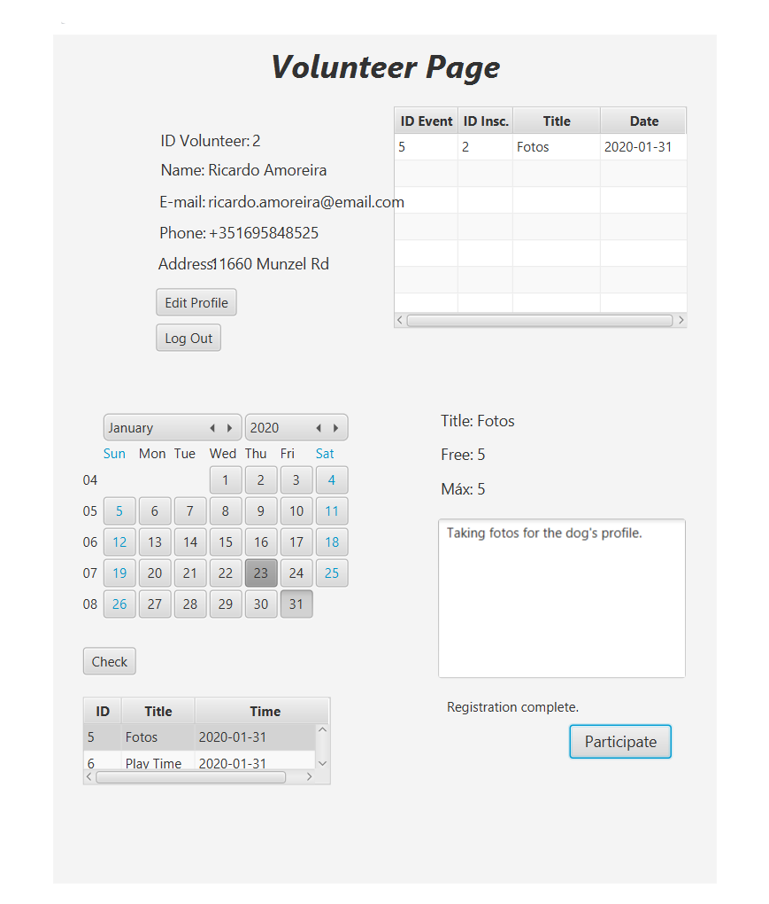
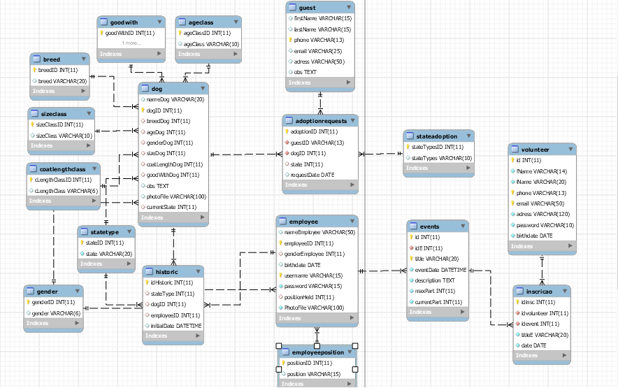
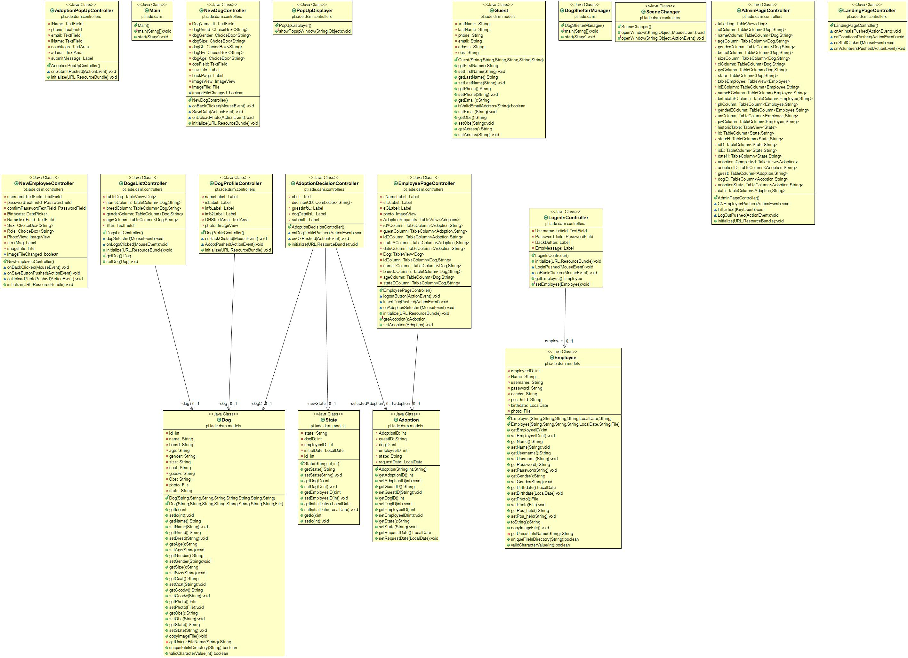

# Welcome to Dog Shelter Manager

	N'zembo  - 50039011
	Bernardo - 50039481
	
## Table of contents

* [Enquadramento](#Enquadramento)
* [Cenários](#Cenários)
* [GUI](#GUI)
* [Diagramas](#Diagramas)
* [Referências](#Referências)	
	 
## Enquadramento
	
  O Dog Shelter Manager é uma plataforma que tem como objetivo facilitar a interação utilizador/abrigo e aperfeiçõar  o gerenciamento do abrigo tornando-o mais eficiente. Nesta plataforma a administração do abrigo tem acesso à ferramentas para agilizar o processo de registro e controlo de cães no abrigo, administrar pedidos de doação e criação/gerencia dos funcionários, os funcionários têm acesso aos perfis dos cães, com a opção de mudar a informação, à lista de pedidos de adoção, podem criar perfis novos e um histórico de mudanças do estado do cão. Os utilizadores têm acesso à ficha de cães que se encontram no abrigo e fazer adoações. A comunicação será automatizada  através de email e telemóvel (função em desenvolvimento).
Após um estudo de mercado podemos concluir que existem websites que promovem este sistema de adoção à distância tais como:
Petfinder e Adoptapet, e muitos outros serviços semelhantes, são websites que permitem procurar por animais abandonados na sua base de dados, e com isso, tomar a decisão de adotar. Também são apoiadas por abrigos e organizações de adoção. A Dog Shelter Manager não faz concorrência direta com estes serviços, pelo contrário, o nosso sistema é focado na gestão de dados de um abrigo só, o que permite maior controlo do abrigo para com o software, levando assim a maior controlo de todos os dados para serem usados em campanhas ou ideias que possam ajudar a salvar mais animais e à personalização do sistema.

## Cenários
* Principal:
	Como cenário principal deste produto, vamos ter em conta a interação entre estes dois utilizadores no caso de adoção. Começando pelo visitante, a primeira página será a "Landing Page", onde se encontram três opções, "Animals", "Volunteers" e "Donations". Neste cenário focaremos na opção de "Animals", onde se encontrarão as funcionalidades base para este projeto, começando pela busca do cão na base de dados. O visitante poderá procurar pelo nome, raça, género ou idade, quando clicar no resultado desejado, o utilizador será redirecionado para um página nova, o perfil do cão, onde terá todas as informações desde fotos, nome, princípais características do animal, condicionamento do cão e um botão que se o utilizador clicar abrirá um pop up de pedido para adoção. 
	Neste pop up, poderá inserir os seus dados como o nome, número de telemóvel, email e condições que possam ser determinantes para a adoção. Após submit o pedido já pode ser visto pelo funcionário, e assim termina a parte de interação do visitante. Os pedidos de adoção enviados encontram-se no perfil dos funcionários, eles têm acesso a esta página apartir de um botão, Log In, que se encontra na "Landing Page", só os funcionários terão acesso a contas no programa. Na página de perfil dos funcionários encontra-se a foto, nome, ID e género, como informação pessoal, tal como duas funcionabilidades como o Upload, que serve para adicionar cães à base de dados, e uma lista de pedidos de adoção, aqui é onde aparece o pedido do visitante. 
	O funcionário pode clicar nos pedidos para abrir um pop up, onde aparece informação de quem mandou o pedido, para que cão o pedido é destinado, a condição do visinante, a opção de ver o perfil do cão, assim auxiliando o funcionário na sua decisão, e uma caixa de opções com duas escolhas, "accepted" e "denied". Apartir deste passo é onde o funcinário usa a informação de contacto para falar com o visitante e assim determinar se é uma boa adoção ou uma má adoção, no caso das condições divulgadas pelo visitante irem contra as condições do cão.   
 
* Secundário:
	Como cenários secundários, temos o comportamento da base de dados no programa e uma funcionalidade de voluntariado.

	Começando pela a adição dos cães à base de dados, ação realizada pelo funcionário no seu perfil, esta funcionalidade tem como objectivo aumentar a eficiência do sistema para o abrigo, ou seja, facilitar o gerenciamento para o funcionário.
O funcionário para adicionar um cão, tem que clicar num botão que se encontra no seu perfil, chamado Upload, isto leva o utilizador(funcionário) a ser redirecionado para outra página onde pode fazer upload da foto do cão, inserir o nome, selecionar as opções das características e condições. Após tudo ser inserido o funcionário pode clicar no upload data para adicionar o cão à base de dados, os perfis dos cães poderam ser modificados nas suas respetivas páginas de perfil, onde aparecerá um botão chamado Change Info (este botão só aparecerá para os funcionários).
	Outro cenário será a arquivação dos dados, após um pedido ser aceite, os dados do cão vão ser ocultados para os utilizadores, na página de pesquisa, caso a adoção correr mal e o cão for devolvido ao abrigo, a sua informação voltará a aparecer para os utilizadores.
	
	Como cenário de Volunteers, o utilizador pode voluntariar-se em dias com evento marcados pelos funcionários.
Para o utilizador aceder a esta funcionalidade, vai clicar no botão de Volunteers, onde lhe levará para a página de logIn dos voluntários, apartir daqui ele pode entrar na sua conta ou criar uma conta de voluntário.
No registo, o voluntário terá um formulário para preencher, após preenchimento ele poderá fazer submit. Depois de registar, um aviso pop-up aparece onde o voluntário receberá um Id de logIn (este Id representa o seu username). Ao fazer logIn, o voluntário será levado para a Volunteer Page, onde aparecem as suas informações do perfil, um calendário interativo para escolher um dia, tabela de eventos em que está registado e uma text box com a informação do evento selecionado. No calendário interativo o voluntário pode consultar os dias em que deseja  fazer voluntariado. Quando seleciona um dia, ele tem um botão Check que diz-lhe os eventos marcados para esse dia. Quando ele deseja registar-se no dia, ele seleciona o evento desejado e clica no Participate. Isso fará com que ele seja registado no dia e os dias em que ele está registado aparecem na tabela perto das suas informações de perfil. O volunteer também tem uma opção de editar o seu perfil.
Para o funcionário, nesta funcionalidade, ele cria os eventos e tem uma coluna na tabela do EmployeePage com os eventos criados.
Ao criar clicar no botão Create Event, o funcionário pode escolher o título e o número máximo de participantes para o evento, pode escolher o dia do evento apartir de um calendário interativo e a hora, também por um slider interativo, e no final uma descrição sobre o evento.

## GUI

Administrator's page.

Creating a new employee.

Employee's page.

Creating a new dog.

Editing a dog's profile.

After selecting category Animals, you get list of dogs.

Dog's profile.

Employee creating a new event.

After selecting category Volunteers, and already registered into the system as volunteer, you get volunteer's page.

	
## Diagramas

## Referências
(2019). Animal Shelters & Rescues for Pet Adoption. Acedido em: 05/10/2019, em: www.petfinder.com.

(2019). Adopt the Perfect Pet. Acedido em: 05/10/2019, em: www.adoptapet.com.

