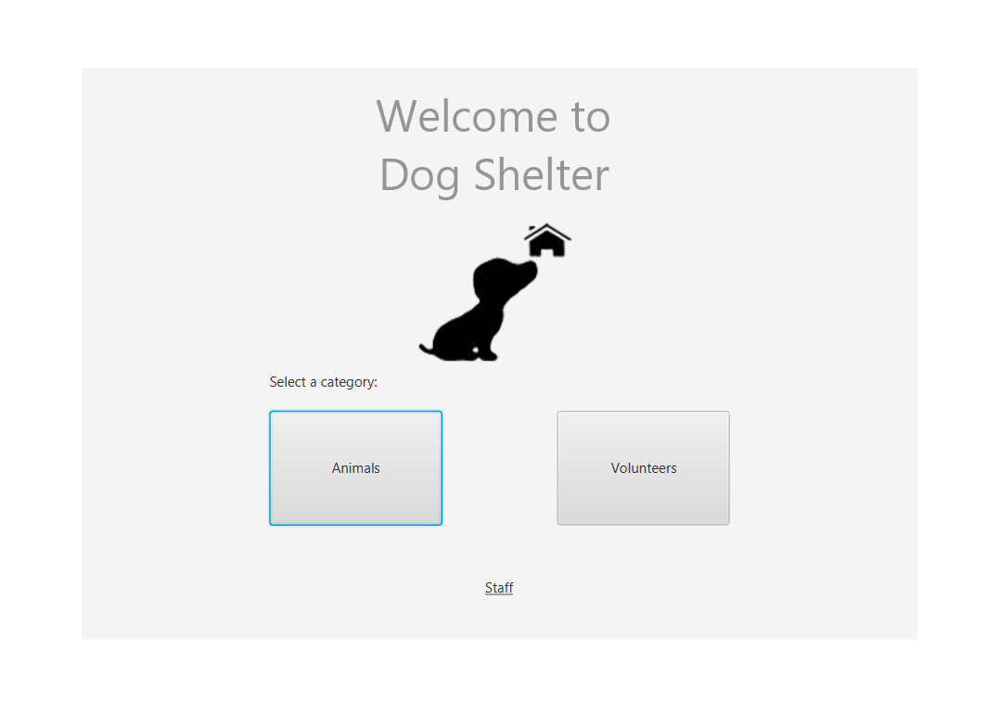

# Welcome to Dog Shelter Manager

	N'zembo  - 50039011
	Bernardo - 50039481
	
## Table of contents
* [GUI](#GUI)
* [Enquadramento](#Enquadramento)
* [Cenários](#Cenários)
* [Diagramas](#Diagramas)
* [Referências](#Referências)	
	 

## GUI

## Enquadramento
	
O Dog Shelter Manager é uma plataforma que tem como objetivo facilitar a interação utilizador/abrigo e aperfeiçoar  gerenciamento do abrigo tornando-o mais eficiente. Nesta plataforma a administração do abrigo tem acesso à ferramentas para agilizar o processo de registro e controlo de cães no abrigo, administrar pedidos de doação e gerencia dos funcionários, já os utilizadores têm acesso à ficha de cães que se encontram no abrigo, fazer adoações e doações.

## Cenários
* Principal:
	Como cenário principal deste produto, vamos ter em conta a interação entre estes dois utilizadores no caso de adoção. Começando pelo visitante, a primeira página será a "Landing Page", onde se encontram três opções, "Animals", "Volunteers" e "Donations". Neste cenário focaremos na opção de "Animals", onde se encontrarão as funcionalidades base para este projeto, começando pela busca do cão na base de dados. O visitante poderá procurar pelo nome, raça, género ou idade, quando clicar no resultado desejado, o utilizador será redirecionado para um página nova, o perfil do cão, onde terá todas as informações desde fotos, nome, princípais características do animal, condicionamento do cão e um botão que se o utilizador clicar abrirá um pop up de pedido para adoção. 
	Neste pop up, poderá inserir os seus dados como o nome, número de telemóvel, email e condições que possam ser determinantes para a adoção. Após o visitante clicar no Submit, os dados do pedido aparecem no perfil do funcionário, e assim termina a parte de interação do visitante. Os pedidos de adoção enviados encontram-se no perfil dos funcionários, eles têm acesso a esta página apartir de um botão, Log In, que se encontra na "Landing Page", só os funcionários terão acesso a contas no programa. Na página de perfil dos funcionários encontra-se a foto, nome, ID e género, como informação pessoal, tal como duas funcionabilidades como o Upload, que serve para adicionar cães à base de dados, e uma lista de pedidos de adoção, aqui é onde aparece o pedido do visitante. 
	O funcionário pode clicar nos pedidos para abrir um pop up, onde aparece informação de quem mandou o pedido, para que cão o pedido é destinado, a condição do visinante, a opção de ver o perfil do cão, assim auxiliando o funcionário na sua decisão, e uma caixa de opções com duas escolhas, "accepted" e "denied". Apartir deste passo é onde o funcinário usa a informação de contacto para falar com o visitante e assim determinar se é uma boa adoção ou uma má adoção, no caso das condições divulgadas pelo visitante irem contra as condições do cão.   
 
* Secundário:
	Como cenários secundários, vamos dar prioridade ao comportamento da base de dados no programa.

	Começando pela a adição dos cães à base de dados, ação realizada pelo funcionário no seu perfil, esta funcionalidade tem como objectivo aumentar a eficiência do sistema para o abrigo, ou seja, facilitar o gerenciamento para o funcionário.
O funcionário para adicionar um cão, tem que clicar num botão que se encontra no seu perfil, chamado Upload, isto leva o utilizador(funcionário) a ser redirecionado para outra página onde pode fazer upload da foto do cão, inserir o nome, selecionar as opções das características e condições. Após tudo ser inserido o funcionário pode clicar no upload data para adicionar o cão à base de dados, os perfis dos cães poderam ser modificados nas suas respetivas páginas de perfil, onde aparecerá um botão chamado Change Info (este botão só aparecerá para os funcionários).
	Outro cenário será a arquivação dos dados, após um pedido ser aceite, os dados do cão vão ser ocultados para os utilizadores, na página de pesquisa, caso a adoção correr mal e o cão for devolvido ao abrigo, a sua informação voltará a aparecer para os utilizadores.
	
	
	
	
* Funcionalidades futuras:
	Como funcionalidades futuras, vamos ter na Landing Page mais 2 duas opções, Volunteers e Donations.

Voluntários
	Nesta opção o utilizador visitante será redirecionado para uma página com um horário interativo, onde poderá selecionar o dia da semana onde deseja voluntariar, cada dia tem o turno da manhã e noite, Morning and Night, isto que permite maior flexiblidade para o utilizador. Ao escolher o dia e o turno, o visitante tem de completar um formulário onde insere o nome, email e telefone, e ainda uma ChoiceBox onde pode escolher o tipo de ajuda como por exemplo passear cães, ajudar na limpeza do abrigo, higienizar os animais, etc. Após tudo completado a opção de submit fica disponível e assim o visitante reservou um lugar para ajudar o abrigo.

Doação
	Na opção de Donations, o utilizador vai ser redirecionado para um página com dois tipos de planos, um plano de pagamento único e um plano de pagamento mensal, após escolher o tipo de pagamento, o utilizador poderá clicar num botão com valores já definidos ou escrever o valor que deseja doar, e tal como nos outros o formulário com nome, email e telefone, mas que neste caso serão opcioninais, caso o doador deseje ser anónimo, e uma última opção onde digita o seu cartão.
	
	
	
## Diagramas

## Referências
(2019). Animal Shelters & Rescues for Pet Adoption. Acedido em: 05/10/2019, em: www.petfinder.com.

(2019). Adopt the Perfect Pet. Acedido em: 05/10/2019, em: www.adoptapet.com.

